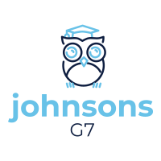
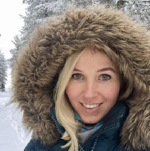
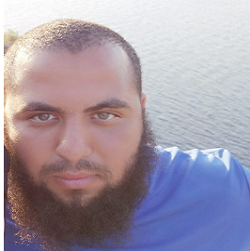
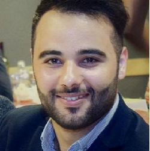
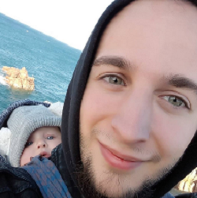

# Weclome to Johnsons G7!

### Hello, my name is Olga and my page on github [here](https://github.com/OKozmovskaia)

> I am Russian and live in Brussels 3 years. I want to be a web-developer.

> **_My favorite phrase: Silence is gold_**

### Hello, my name is Yassin

Check [My Github](https://github.com/Makraiyassin/markdown-challenge) ! ^^

##### My goal after Becode, is to continue to improve my capacity as a web developer while immersing myself in the work.
I like to create, type, modify the code, and make it my profession and my specialty is my goal.

###### *"it is by making mistakes that we learn not to make any more"* ;)

### Hello, I am Abod

you can check [ my github](https://github.com/Abdulrazak-alkhamry)

*I am conscientious and quick by nature to carry out the various missions of the day which are entrusted to me, after Becode, my goal is to continue to improve my capacity as a full stack web developer, keep learning, and get into new challenges*

###### "Failure is success if we learn from it"

### Hey! Sylvain here ;)

check [my github](https://github.com/SylvainDurant/markdown-challenge)!

_what to say about me? let's start from the top! Proud father of two sons (Ethan 2 and a half years old & Arthur 1 year old) and maried to a beautifull wife. I'm in a metal band, [RavenscaR](https://ravenscarband.bandcamp.com/releases), I do Streams on [Twitch](https://www.twitch.tv/bel6team) and i love coding too! After this formation, my goal is to find a job ASAP in a nice start up or compagny._

**_If Metal is Satan works... then the devil has very good taste in music!_**
